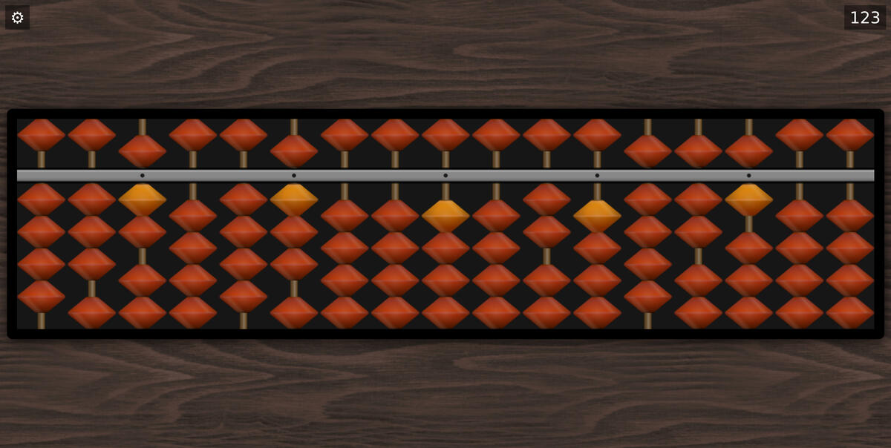
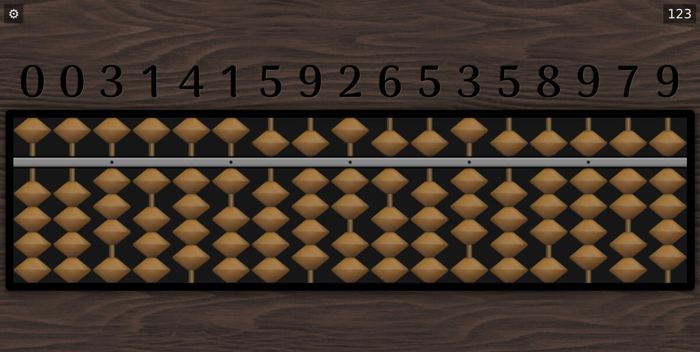
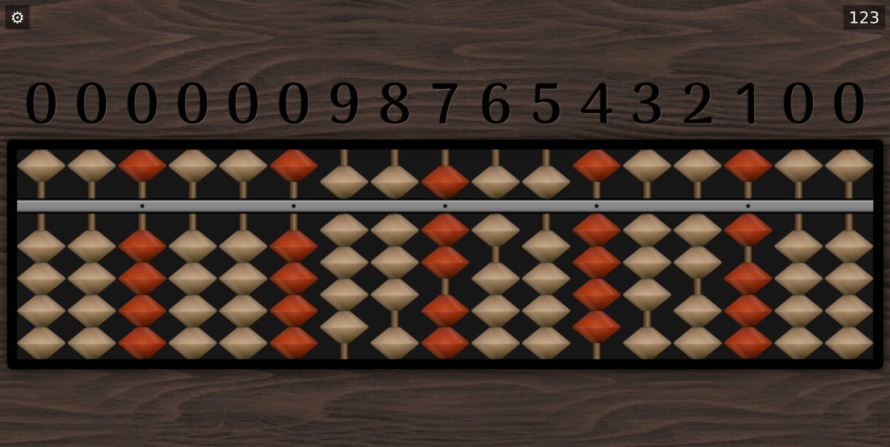
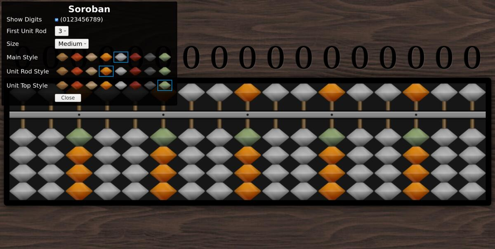

Soroban
=======

This is a digital version of the Soroban, a Japanese abacus.

To use it, go to: https://fjolliton.github.io/soroban/

While it can be used with a mouse on a computer, it's best manipulated
from a tablet (or maybe a phone). In particular, it is intended to
works on all iPad (even the oldest ones).

Screenshots
-----------

Setup
-----

On iOS devices (iPhone and iPad), to use it as an application, visit
the main URL:

https://fjolliton.github.io/soroban/

then Safari provides an option to add it to the home screen. You can
find this option from the menu represented with an icon with an arrow.
If you do that, you will get an icon to directly launch the soroban,
in full screen.

License
-------

This projet is released under the CC0 license. See
https://creativecommons.org/publicdomain/zero/1.0/

Credits
-------

Contains Assets from CC0Textures.com, licensed under the Creative Commons CC0 License. Link to the texture: https://cc0textures.com/view?id=Wood051
